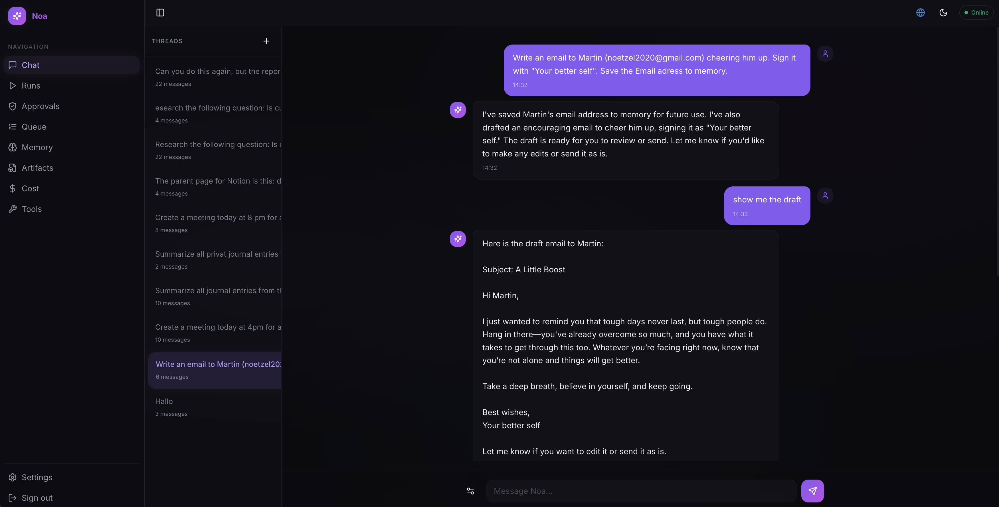
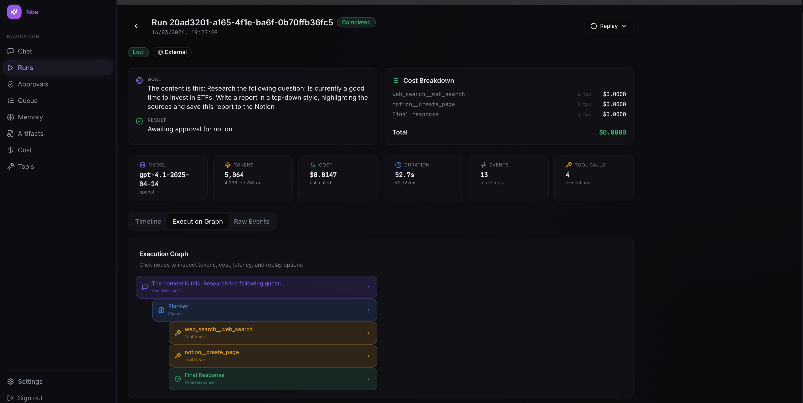
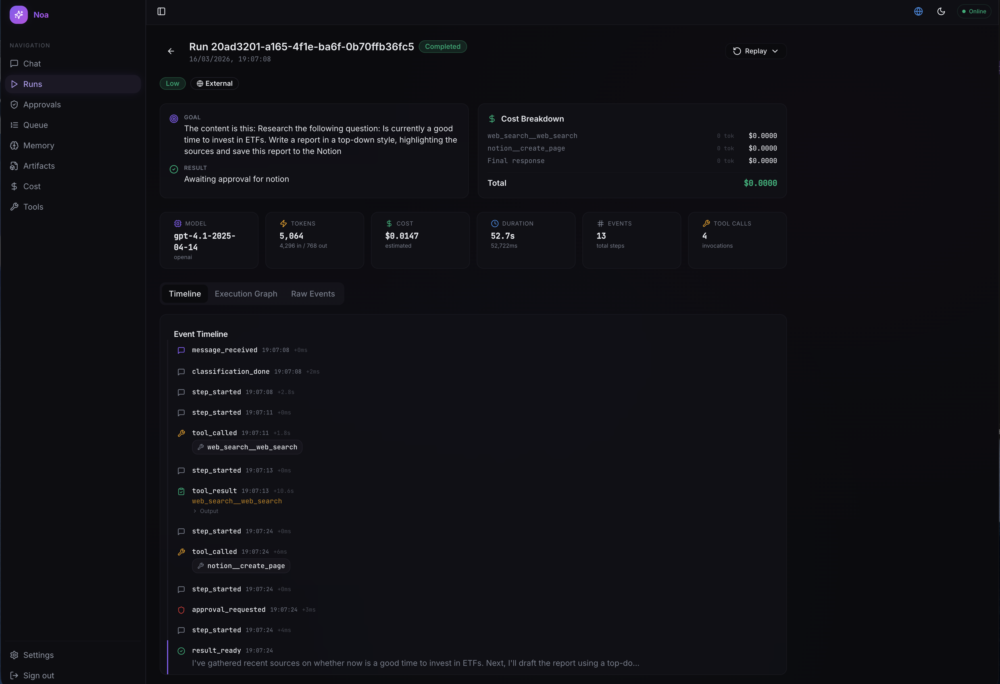
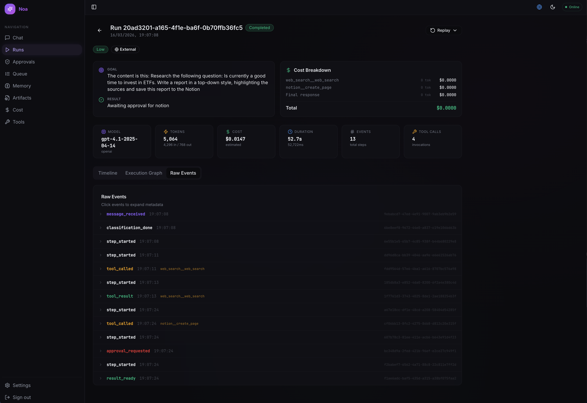
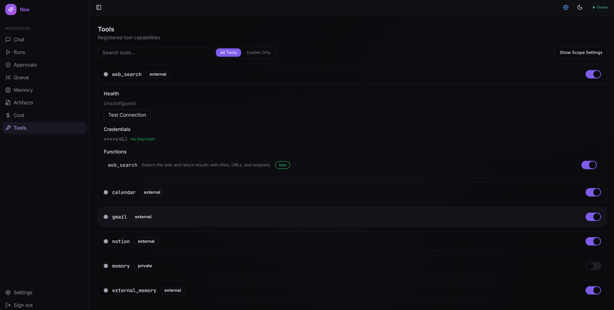
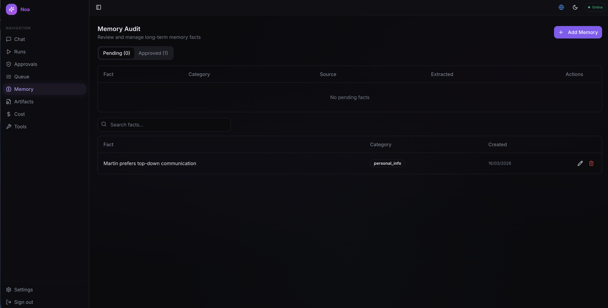
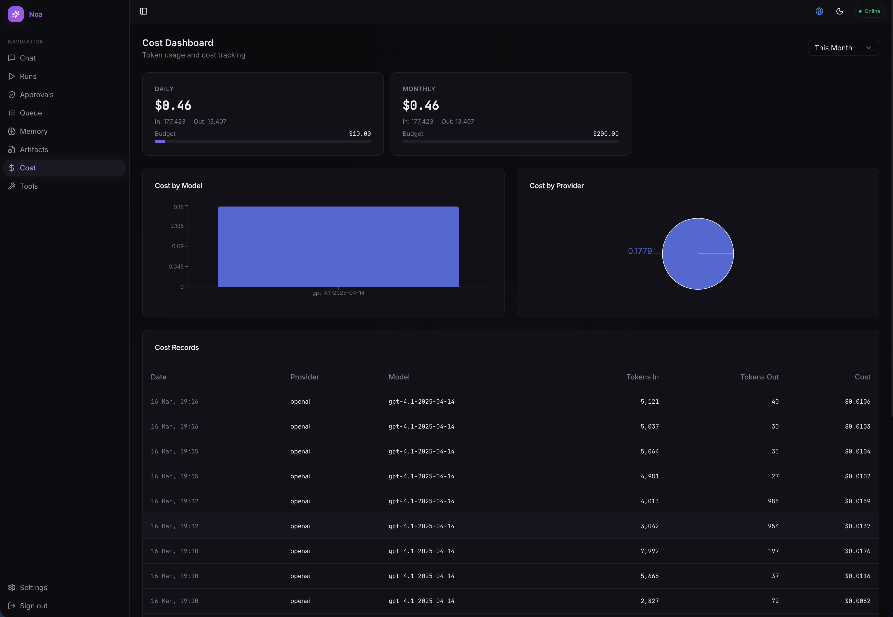

# Noa

**A governed personal AI agent with dual-domain architecture.**

Noa is a self-hosted AI agent that enforces privacy boundaries through container-level network isolation, governs every action through risk-tiered approvals, tracks costs with hard budget limits, and integrates with Google Calendar, Gmail, Notion, and web search. It ships with a React web UI and a native iOS app.

Built as a portfolio project demonstrating applied agent engineering: LangGraph state machine orchestration, container-based domain isolation, function-level tool governance, immutable audit logging, multi-provider LLM routing, and production-grade infrastructure with 2,100+ tests across 123 test files.



---

## Table of Contents

- [Quick Start](#quick-start)
- [Problem Statement](#problem-statement)
- [What It Does](#what-it-does)
- [Architecture](#architecture)
- [Agent & Prompt Engineering](#agent--prompt-engineering)
- [Tech Stack](#tech-stack)
- [How to Run and Test](#how-to-run-and-test)
- [What to Review](#what-to-review)
- [Key Design Decisions](#key-design-decisions)
- [Known Limitations](#known-limitations)
- [Questions for the Reviewer](#questions-for-the-reviewer)
- [Screenshots](#screenshots)
- [Roadmap](#roadmap)

---

## Quick Start

```bash
git clone git@github.com:TuringCollegeSubmissions/mnoetz-AE.3.5.git && cd noa

# 1. Configure environment
cp .env.example .env
# Edit .env — add at least one LLM provider key (ANTHROPIC_API_KEY or OPENAI_API_KEY)

# 2. Start everything (backend + database + workers)
./noa dev-full workers

# 3. Run database migrations
./noa db migrate

# 4. Start the frontend (separate terminal)
cd web && npm install && npm run dev
# → http://localhost:5173
```

That's it. The `noa` CLI handles Docker Compose, database setup, and health checks. Run `./noa` without arguments to see all available commands.

> **macOS users:** Secrets can alternatively be stored in Keychain instead of `.env` — see [docs/SETUP.md](docs/SETUP.md).

---

## Problem Statement

Existing AI assistants operate as black boxes — they route all data through cloud servers, offer no governance over what actions the agent takes, provide no cost transparency, and give users no control over privacy boundaries.

Noa addresses this by enforcing:

- **Domain isolation** — private data processed by local models in a network-isolated container with no internet access
- **Risk-tiered approvals** — low-risk actions auto-approve, medium-risk show a preview, high-risk require biometric step-up authentication
- **Hard budget limits** — per-task, daily, and monthly cost caps enforced before execution
- **Immutable audit log** — every action recorded in a hash-chain log for tamper detection

---

## What It Does

1. User sends a message in the **Chat** interface (web or iOS)
2. The **privacy router** classifies the request as private or external based on content analysis, tool dependencies, and user overrides
3. The **LangGraph orchestrator** runs the deterministic state machine: router → agent → tools → responder
4. The **agent node** invokes the appropriate LLM (local Ollama or cloud API) with available tools
5. **Tool calls** are dispatched through the governed gateway — rate-limited, idempotent, audited, risk-classified
6. Results stream back via **SSE** in real time with tool call visibility
7. The **cost tracker** records token usage and checks budget limits at every step

### Dual-Domain Architecture

| Domain | Network | LLM | Tools | Internet |
|--------|---------|-----|-------|----------|
| **Private** | `noa-internal` (sealed) | Ollama (local) | Memory (remember/recall) | None |
| **External** | `noa-external` | Anthropic, OpenAI, Google AI | Calendar, Gmail, Notion, Web Search | HTTPS only |
| **Gateway** | Both networks | Routes between domains | All (governed) | Bridges both |

### Risk-Tiered Approval Model

| Tier | Examples | Approval | Step-Up Auth |
|------|----------|----------|--------------|
| **Low** | Web search, read emails, list events | Auto-approve | No |
| **Medium** | Send email, create event, write Notion | Preview + confirm | No |
| **High** | Delete data, system changes | Preview + confirm | Biometric (iOS) |

---

## Architecture

### Orchestrator (LangGraph State Machine)

```
__start__ → ROUTER → AGENT ──(has tool_calls)──→ TOOLS ──(rounds < max)──→ AGENT
                       │                           │
                       └──(no tool_calls)──→ RESPONDER ←──(rounds >= max)──┘
                                                │
                                             __end__
```

**Bounded autonomy:** Max 10 tool calls per step, max 3 rounds (configurable), 120-second timeout, cost tracking at every iteration.

### Data Flow

```
User Message → Web UI / iOS App
    ↓
POST /api/v1/chat (SSE stream)
    ↓
OrchestratorRunner.run()
    ↓
LangGraph: router_node → agent_node → (conditional) tool_node → responder_node
    ↓
Provider dispatch (Anthropic / OpenAI / Google AI / Ollama)
    ↓
Tool calls → ToolGateway → Adapters (Google, Notion, Tavily, Memory)
    ↓
SSE event stream: meta → tool_calls → tool_results → response → done
    ↓
RunService persists Run + Events + UsageStats to PostgreSQL
```

**Key isolation guarantee:** The `noa-internal` Docker network has no internet route. Even if the private worker code had a bug that tried to phone home, the network layer blocks it. Private data physically cannot leave the machine.

### Services

| Service | Role | Network |
|---------|------|---------|
| `noa-api` | FastAPI backend (gateway) | Internal + External |
| `private-worker` | Ollama LLM for private domain | Internal only |
| `external-worker` | Cloud LLM API access | External only |
| `postgres` | PostgreSQL 16 database | Internal |
| `caddy` | Reverse proxy, TLS termination | Both |
| `backup` | Scheduled encrypted backups (pg_dump + GPG) | Internal |
| `migrate` | Alembic migration runner | Internal |

> For the full system diagram, component table, and project structure, see [docs/Tech.md](docs/Tech.md).

---

## Agent & Prompt Engineering

### System Prompt

The system prompt (`prompts/system_prompt.txt`) is the single source of truth — the UI reads from and writes to this file directly (no hidden backend overrides). It enforces bounded autonomy, approval awareness, privacy transparency, and proactive memory.

### Privacy Classification

| Signal | Priority | Example |
|--------|----------|---------|
| Explicit user override | Highest | User sets `privacy_mode: "private"` |
| Tool dependency | High | Request needs Gmail → external domain |
| Content analysis | Medium | Keywords like "journal", "diary", "password" → private |
| Fail-safe default | Lowest | Low confidence → defaults to private (safer) |

### Tool Governance

Tools are dispatched through a governed gateway with 8-step enforcement per call: capability check → rate limit → idempotency → risk classification → execution → output validation → audit → cost tracking.

| Tool | Functions | Risk Tier | Domain |
|------|-----------|-----------|--------|
| **Web Search** | `web_search()` | Low | External |
| **Calendar** | `list_events()`, `create_event()` | Low / Medium | External |
| **Gmail** | `search_emails()`, `read_email()`, `send_email()` | Low / Medium | External |
| **Notion** | `search_pages()`, `read_page()`, `create_page()` | Low / Medium | External |
| **Memory** | `remember()`, `recall()` | Medium | Private |

### Multi-Model Routing

| Provider | Models | Use Case |
|----------|--------|----------|
| **Anthropic** | Claude Sonnet 4, Haiku 4.5, Opus 4 | Default external provider |
| **OpenAI** | GPT-4.1, GPT-4.1-mini, GPT-4o, GPT-4o-mini | Alternative external |
| **Google AI** | Gemini Pro | Google ecosystem tasks |
| **Ollama** | Any local model (Llama 3.1, Qwen 3, Mistral, ...) | Private domain (free, offline) |

Users select the model per conversation in the UI. The router enforces that private-mode requests never reach cloud providers.

### Tool Chaining Example

```
User: "Find the latest news about AI regulation and email me a summary"

Round 1: web_search("AI regulation latest news 2026")
Round 2: send_email(to: user, subject: "AI Regulation Summary", body: <synthesized>)
         → Triggers Medium-risk approval gate → User approves → Email sent
```

---

## Tech Stack

| Category | Technology |
|----------|------------|
| **Language** | Python 3.11+ (backend), TypeScript 5.x (frontend), Swift 6 (iOS) |
| **Backend** | FastAPI, SQLAlchemy 2.0 (async), Alembic, Pydantic v2 |
| **Orchestration** | LangGraph + LangChain Core (state machine, conditional edges) |
| **Database** | PostgreSQL 16 (asyncpg) |
| **Auth** | JWT (python-jose), bcrypt, Google OAuth 2.0 |
| **Cloud LLMs** | Anthropic SDK, OpenAI SDK, Google AI SDK |
| **Local LLM** | Ollama |
| **Frontend** | React 18, Vite, Tailwind CSS, Radix UI, TanStack Query, Zod |
| **iOS** | SwiftUI, async/await actors, ASWebAuthenticationSession |
| **Streaming** | Server-Sent Events (SSE) with 15s keepalive |
| **Reverse Proxy** | Caddy (TLS, Let's Encrypt) |
| **Containers** | Docker Compose (7 services, 2 isolated networks) |
| **Security** | nh3 (HTML sanitization), DOMPurify (frontend), certificate pinning (iOS) |
| **Testing** | pytest (2,100+), Vitest, Playwright, XCTest |
| **Static Analysis** | ruff, mypy (strict), ESLint, TypeScript strict |

---

## How to Run and Test

### Prerequisites

- Docker Desktop (macOS or Linux)
- Node.js 18+ (for frontend)
- At least one LLM API key (Anthropic, OpenAI, or Google AI)
- Ollama (optional, for private domain — runs inside Docker if not installed locally)

### Setup

```bash
# 1. Clone and configure
git clone git@github.com:TuringCollegeSubmissions/mnoetz-AE.3.5.git && cd noa
cp .env.example .env
# Edit .env — add your API key(s) and review the defaults

# 2. Start the full stack
./noa dev-full workers
# Starts: postgres, noa-api, private-worker, external-worker

# 3. Run migrations
./noa db migrate

# 4. Frontend (separate terminal)
cd web && npm install && npm run dev
# → http://localhost:5173

# 5. Verify everything is running
./noa health
```

### The `noa` CLI

The project includes a CLI that wraps all common operations:

```
./noa                     Start all services
./noa dev-full workers    Full dev stack with LLM workers
./noa health              Run health checks against all services
./noa status              Show service status
./noa logs [service]      Tail logs (all or specific service)
./noa test                Run the full test suite
./noa db migrate          Run database migrations
./noa db console          Open a psql shell
./noa shell [service]     Open a shell in any container
./noa backup              Trigger a manual encrypted backup
```

### Run Tests

```bash
# Backend
pytest tests/unit/ -v                         # Unit tests (fast)
pytest tests/integration/ -v                  # Integration (requires Postgres)
pytest tests/ --cov=src/noa --cov-report=html # Full suite + coverage

# Static analysis
ruff check src/ && mypy src/

# Frontend
cd web && npm test                            # Vitest
cd web && npm run test:e2e                    # Playwright E2E
```

### What You Need to Test Each Feature

| Feature | Required Keys | How to Verify |
|---------|---------------|---------------|
| Chat (external) | `ANTHROPIC_API_KEY` or `OPENAI_API_KEY` | Send a message in the Chat UI |
| Chat (private) | Ollama running | Send a message with private mode toggled |
| Google Calendar | `GOOGLE_CLIENT_ID` + `GOOGLE_CLIENT_SECRET` | Tools page → connect Google → list events |
| Gmail | Same as Calendar (shared OAuth) | Search or read emails |
| Notion | `NOTION_TOKEN` | Tools page → search Notion pages |
| Web Search | `TAVILY_API_KEY` | Ask a question requiring current info |
| Memory | None (local) | Ask Noa to remember something, then recall it |
| Cost tracking | Any LLM key | Check the Cost page after a conversation |

---

## What to Review

### Start Here (6 files)

| File | Description |
|------|-------------|
| `src/noa/orchestrator/graph.py` | LangGraph state machine — topology, conditional edges, bounded autonomy |
| `src/noa/orchestrator/runner.py` | Execution engine — compiles graph, streams SSE events, enforces timeout |
| `src/noa/tools/gateway.py` | Tool dispatch — rate limiting, idempotency, audit, cost tracking |
| `src/noa/orchestrator/nodes/router.py` | Privacy classification — domain routing, model selection |
| `src/noa/policy/engine.py` | Approval framework — risk tiers, step-up auth |
| `src/noa/api/v1/chat.py` | Chat endpoint — SSE streaming, orchestrator invocation |

### Architectural Decisions to Validate

- Dual-domain isolation via Docker networks (not row-level filtering or encryption)
- LangGraph for deterministic outer shell with bounded LLM autonomy inside
- Fixed graph topology with conditional edges (not dynamic graph construction)
- File-based system prompt as single source of truth (UI reads/writes directly)
- Function-level tool capabilities (not just tool-level on/off)
- Hash-chain audit log for tamper detection
- Idempotency at the gateway level (not relying on LLM deduplication)
- JWT with httpOnly cookies (not localStorage) for session management

> For the full file list (13 additional files), see [docs/Tech.md](docs/Tech.md#key-components-deep-dive).

---

## Key Design Decisions

| Decision | Rationale |
|----------|-----------|
| **Dual-domain network isolation** | Container-level network isolation guarantees private data never reaches the internet — simpler and stronger than row-level filtering or encryption at rest |
| **LangGraph deterministic orchestrator** | Fixed topology with conditional edges gives predictable execution while allowing multi-step tool chaining within bounded limits |
| **Risk-tiered approval model** | Graduated trust matches action consequence — read operations auto-approve, writes require confirmation, deletes require biometric |
| **Function-level tool governance** | Granting `gmail.read_email` without `gmail.send_email` gives fine-grained control that tool-level on/off cannot achieve |
| **Hard budget enforcement** | Cost limits are enforced before execution (not after) — prevents bill shock from runaway API calls |
| **Immutable hash-chain audit** | Each entry references the prior entry's hash — tampering is detectable without a separate integrity service |
| **File-based system prompt** | `prompts/system_prompt.txt` is the single source of truth — the UI reads and writes it directly, no hidden backend overrides |
| **SSE streaming with keepalive** | 15-second keepalive pings prevent proxy timeouts during long tool calls; clients see real-time tool execution |
| **iOS native with certificate pinning** | SPKI-based pinning in release builds prevents MITM; offline queue handles network interruptions |

---

## Known Limitations

| Limitation | Status | Mitigation |
|------------|--------|------------|
| Local model quality varies by hardware (70b needs significant VRAM) | By design | 3-tier model policy: 8b fast, 14b default, 70b judge — users select based on hardware |
| Single-user system (no multi-tenancy) | By design | Personal agent running on personal hardware; designed for one user |
| Single-machine container isolation (not physical) | Phase 1 | Phase 2 targets dedicated hardware for private domain with mTLS |
| Memory grows unbounded | Open | Manual clearing available; no automatic pruning yet |
| Ollama structured output depends on model compliance | Mitigated | JSON schema in API payload + repeated instructions in prompt |

---

## Questions for the Reviewer

1. **Domain isolation** — Is container-level network isolation sufficient for Phase 1, or should encryption at rest be added for the private domain before moving to physical isolation?
2. **Approval model** — Are the 3 risk tiers (Low/Medium/High) well-calibrated? Should there be a 4th tier for irreversible actions (e.g., "delete all emails matching...")?
3. **Tool governance** — Is function-level capability granting the right granularity, or is it over-engineered for a single-user system?
4. **Agent autonomy** — Is 3 tool-rounds with 10 calls per round the right balance between capability and safety?
5. **Biggest risk** — What is the single biggest architectural risk you see?

---

## Screenshots

<details>
<summary>Run Detail — Execution Graph</summary>

Inspect any run's orchestrator path: which nodes fired, which tools were called, cost per step.



</details>

<details>
<summary>Run Detail — Event Timeline</summary>

Chronological view of every event in a run — tool calls, approval gates, latency deltas.



</details>

<details>
<summary>Run Detail — Raw Events</summary>

Expandable raw event log with metadata and event IDs for debugging.



</details>

<details>
<summary>Tools</summary>

Manage tool capabilities at the function level. Each tool shows its domain, risk tier, credential status, and health.



</details>

<details>
<summary>Memory</summary>

Review and manage long-term memory facts. Pending facts require approval before the agent can use them.



</details>

<details>
<summary>Cost</summary>

Track token usage, per-run costs, and budget limits across all providers.



</details>

---

## Roadmap

| Phase | Scope | Status |
|-------|-------|--------|
| **Waves 1-22** | Core platform: backend, iOS, web, tools, governance, domain isolation, quality infra (130+ phases) | Complete |
| **Auth Stability** | Session validation, error clarity, 7-day tokens, startup check | Complete |
| **Wave 23** | Code quality: wire audit, enum consistency, strict typing | In Progress |
| **Wave 24** | Observability: health dashboard, error rate tracking, structured logging | Planned |
| **Phase 2** | Physical isolation: dedicated Mac for private domain, mTLS, air-gapped network | Planned |
| **Future** | MCP Server: expose Noa as an MCP server for Claude Desktop integration | Planned |

---

## References

- [docs/Tech.md](docs/Tech.md) — Technical deep-dive (architecture, components, test coverage)
- [docs/SETUP.md](docs/SETUP.md) — Full setup guide (secrets, Ollama, TLS)
- [docs/RUNBOOK.md](docs/RUNBOOK.md) — Operations and troubleshooting
- [docs/GETTING_STARTED.md](docs/GETTING_STARTED.md) — Quick start for developers
- `Plan/PLAN.md` — Wave and phase status tracking

---

## License

Copyright (c) 2024-2026 Martin Noetzel. All rights reserved.

This software and its source code are proprietary. No part of this project may be copied, modified, distributed, or used without explicit written permission from the author.
